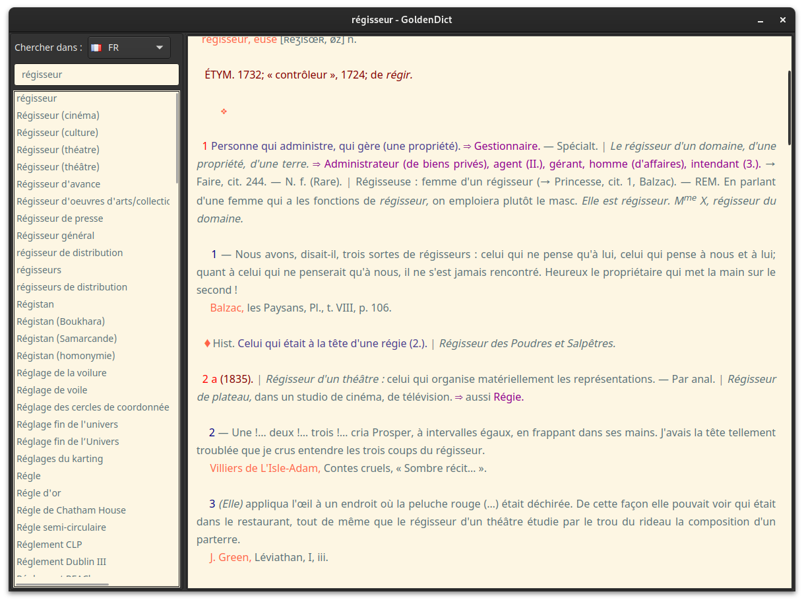

# License

Attribution-NonCommercial 2.0 Generic ([CC BY-NC 2.0](https://creativecommons.org/licenses/by-nc/2.0/)) 

# Goldendict theme

To install the default theme in Linux, you can follow one of these two methods:

- Copy the *article-style.css* and *qt-style.css* files into the *~/.goldendict* directory.

- Unzip the *styles.zip* file into the *~/.goldendict/styles* directory.

## Default theme

## Light theme

## Dark theme

