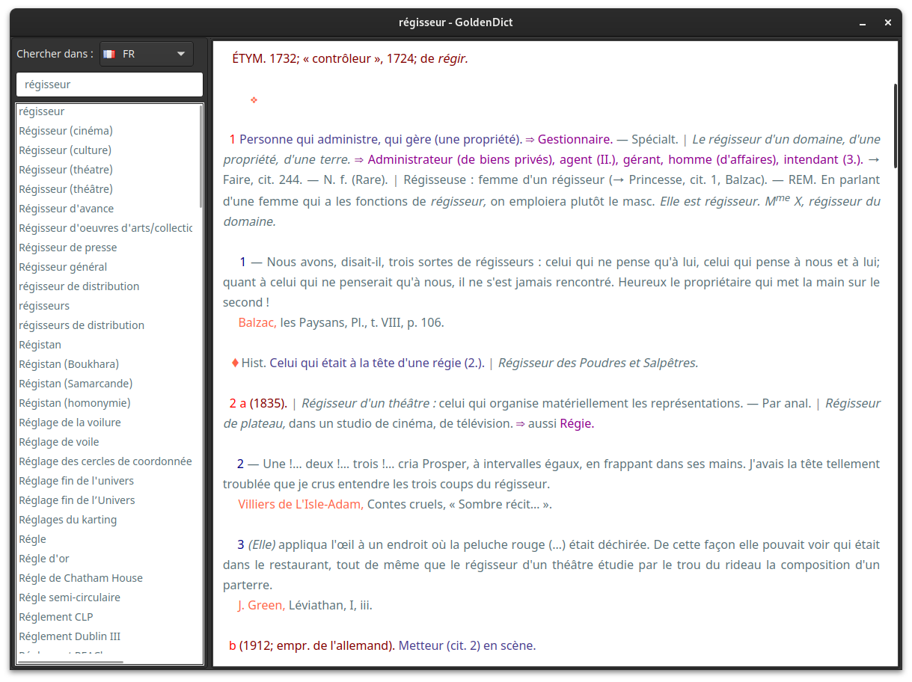
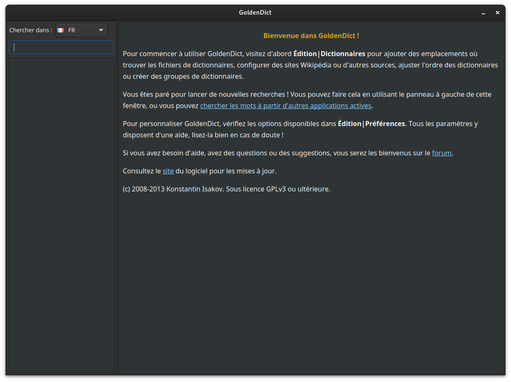

# License

Attribution-NonCommercial 2.0 Generic ([CC BY-NC 2.0](https://creativecommons.org/licenses/by-nc/2.0/)) 

# Goldendict theme

To install the default theme in Linux, you can follow one of these two methods:

- Copy the *article-style.css* and *qt-style.css* files into the *~/.goldendict* or *~/.config/goldendict* directory.

- Unzip the *styles.zip* file into the *~/.goldendict/styles* or *~/.config/goldendict/styles* directory.

- Bonus:

  For a dark mode interface qt5, in my case, I use the Adwaita-Dark theme with aide of *qt5ct*. So, I added this line to my ~/.bashrc file.

  ```bash
  export QT_QPA_PLATFORMTHEME=qt5ct
  export QT_STYLE_OVERRIDE=Adwaita-Dark
  ```

## Default theme



## Light theme


## Dark theme




